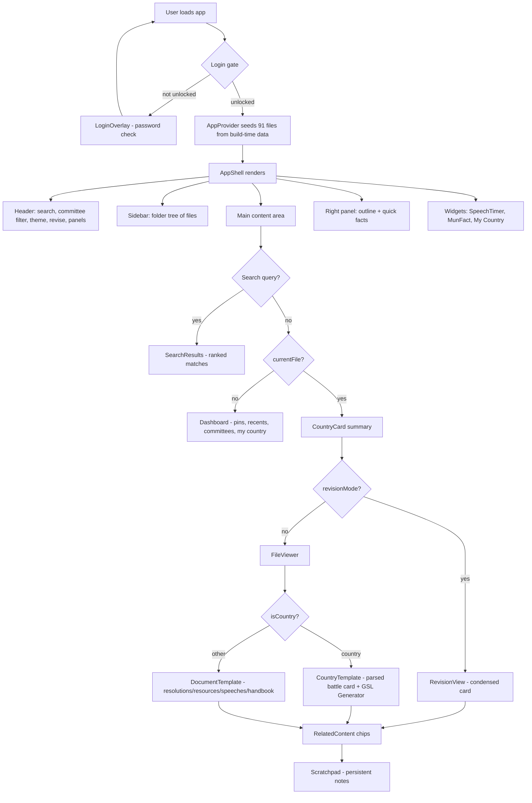

# MUN Research Hub — Technical Documentation

*Version 1.0 · A complete explanation of the project based on inspection of the existing codebase (no code was modified).*

---

## 1. Project Overview

**MUN Research Hub** is a client-side research library and preparation toolkit for **Model United Nations (MUN) delegates**. It replaces the chaos of scattered `.txt` files and Google Docs with a single, fast, offline-capable web application where a delegate can browse country research, prepare speeches, draft resolutions, and revise minutes before entering committee.

**Who it is for**
- MUN delegates preparing for **UNHRC** (Human Rights Implications of AI, Mass Digital Surveillance & Data Privacy) and **UNSC** (Global Supply Chain Security & Maritime Trade Resilience) committees.
- Delegates who need quick access to country "battle cards", agenda handbooks, GSL speech templates, resolution clause banks, and general MUN guides.

**Primary purpose**
- Organize ~91 plain-text research documents into a browsable, searchable, structured knowledge base.
- Provide *in-session tools*: a GSL (General Speaker's List) speech generator, a speech timer, a scratchpad, a "revision mode" for last-minute cramming, and a My-Country quick-access dashboard.
- Persist all user work (theme, pinned files, recents, folder state, scratchpad, my country) in the browser via `localStorage`.

**Problems it solves**
1. **Discovery** — folders of text files are unsearchable; the app scans `data/` at build time and renders a file-tree sidebar with full-text search.
2. **Reading speed** — raw text files are hard to scan; a custom content parser converts loose "battle card" markup into styled, color-coded cards.
3. **Time pressure** — the GSL generator and speech timer address the 60–120 second speaking slots that dominate MUN debate.
4. **Last-minute revision** — a condensed "revision mode" distills each file to its key facts.
5. **Friction** — everything runs in the browser, works offline, and remembers the delegate's state between sessions.

**Overall vision**
A zero-cost, zero-dependency-on-AI-APIs, self-contained MUN preparation hub: one codebase, static text content as the database, and a rich editor-style UI (sidebar + right panel, dark/light themes, keyboard shortcuts) that feels like a professional IDE for diplomacy.

---

## 2. Technology Stack

| Layer | Technology | Why it is used |
|---|---|---|
| **Framework** | **Next.js 16.2.12** (App Router) | Server components read the `data/` folder at build time and pre-render every page (SSG). Turbopack is enabled (`next.config.ts` → `turbopack: { root: process.cwd() }`) for fast dev/build. |
| **Language** | **TypeScript 5** (strict mode) | Full type coverage across the app: `MunFile`, `CountryInfo`, `SectionItem`, `GslOutput`, etc. Path alias `@/* → ./src/*`. |
| **UI Library** | **React 19.2.4** | Client components (`'use client'`) for the interactive shell; context-based state. |
| **Styling** | **Plain CSS** — `src/app/globals.css` (~3,271 lines) with CSS custom properties | A single hand-written stylesheet drives the entire design system. **Note:** Tailwind CSS 4 + `@tailwindcss/postcss` are installed (in `package.json`/`postcss.config.mjs`) but **not used anywhere** in `src/` — no `@tailwind` or `@apply` directive exists. The app is 100% plain CSS. |
| **Build tooling** | Next.js build pipeline + ESLint 9 flat config (`eslint.config.mjs`) | `eslint-config-next` 16 (core-web-vitals + typescript presets). `globalIgnores`: `.next/**`, `out/**`, `build/**`, `next-env.d.ts`, `Archive/**`. Lint currently passes at 0 errors / 0 warnings. |
| **Routing** | **App Router** with `generateStaticParams` | `/`, `/search` (static); `/committee/[committee]` (UNHRC, UNSC) and `/global/[slug]` (24 profiles) pre-rendered at build. |
| **State management** | **React Context** (`AppContext.tsx`) + a custom **`usePersistentState`** hook | Context holds ephemeral UI state; the hook (built on `useSyncExternalStore`) syncs persistent state to `localStorage` and supports cross-tab updates. |
| **Storage** | **`localStorage`** | Keys: `mun_theme`, `mun_my_country`, `mun_pinned_files`, `mun_recent_files`, `mun_folder_states`, `mun_hub_state`, `mun_scratchpad`, `mun_unlocked`. |
| **Deployment** | **Vercel** (`vercel.json`: framework `nextjs`, build `npx next build`, output `.next`) | Static-first output; no server runtime required. |
| **Markdown/rendering libs** | `gray-matter`, `react-markdown`, `rehype-highlight` (in `package.json`) | **Installed but unused in `src/`.** Document rendering is done by the custom `content-parser.ts` instead. This appears to be leftover from an earlier iteration. |
| **Icons** | **Emoji** (no icon library) | Flags via a country→flag map in `countries.ts`; UI icons are inline emoji glyphs (🎤 📌 🕊️ ⚓ etc.). |
| **Fonts** | **System font stack** (`--font-family` in CSS) | `layout.tsx` does **not** use `next/font` (despite the default README mentioning Geist). No webfont download = faster, offline-friendly. |
| **Speech generation** | **Deterministic template engine** (`gsl-generator.ts`) | No external AI API — template selection is seeded so "Regenerate" yields new variations for free. |

---

## 3. Folder Structure

```
c:\Users\nirva\Downloads\MUN\
├─ src/                         ← Application source
│  ├─ app/                      ← Next.js App Router pages + global styles
│  │  ├─ layout.tsx             Root layout: metadata, viewport, theme-init script
│  │  ├─ page.tsx               Home page (server) → HomeClient
│  │  ├─ globals.css            Entire design system (~3,271 lines)
│  │  ├─ HomeClient.tsx         Home app shell (header/sidebar/dashboard)
│  │  ├─ not-found.tsx / error.tsx / loading.tsx   Branded fallback pages
│  │  ├─ search/                Search page + client
│  │  ├─ committee/[committee]/ UNHRC/UNSC committee pages + client
│  │  └─ global/[slug]/         24 global-reference country pages + client
│  ├─ components/               Client UI components (Header, Sidebar, Dashboard,
│  │                            FileViewer, CountryTemplate, DocumentTemplate,
│  │                            SectionView, RevisionView, RightPanel, SearchResults,
│  │                            CountryCard, RelatedContent, Scratchpad, GslGenerator,
│  │                            SpeechTimer, MunFact, MyCountrySelector, Widgets,
│  │                            LoginOverlay, KeyboardShortcuts)
│  └─ lib/                      Framework-agnostic logic
│     ├─ types.ts               MunFile, CountryInfo, MyCountry, SearchResult, GslOutput
│     ├─ files.ts               Build-time scan of data/ → MunFile[]
│     ├─ content-parser.ts      Battle-card markup → structured sections
│     ├─ countries.ts           Flags, icons, country info, outline, reading time
│     ├─ search.ts              Relevance-scored full-text search + highlight
│     ├─ gsl-generator.ts       Deterministic speech generator
│     ├─ AppContext.tsx         Global state provider + useApp()
│     ├─ use-persistent-state.ts  localStorage-synced state hook
│     ├─ use-keyboard-shortcuts.ts  Global shortcut hook
│     └─ use-swipe.ts           Mobile swipe gesture hook
├─ data/                        ← THE content database (plain-text research)
│  ├─ basics/        3 files    MUN basics, README, Sample Position Paper
│  ├─ global/        24 files   Country profiles (QUICK SUMMARY…FOREIGN POLICY)
│  ├─ unhrc/         29 files   15 Countries + Speeches + Resolutions + Resources + Handbook
│  └─ unsc/          35 files   20 Countries + Speeches + Resolutions + Resources + Handbook
├─ Archive/                     ← LEGACY pre-migration static HTML/JS app
│  ├─ index.html, script.js, style.css, manifest.js, build_manifest.ps1
│  ├─ Global Reference/, UNHRC/, UNSC/, Mun basics/   (duplicate of data/)
│  └─ NEXTJS_MIGRATION_PLAN.md  ← The plan that this Next.js app was built from
├─ public/                      favicon.png
└─ configs: next.config.ts, tsconfig.json, eslint.config.mjs,
            postcss.config.mjs, vercel.json, package.json
```

### Responsibility summary
- **`src/app/`** — routing, server-side data loading, metadata, layout, fallback pages.
- **`src/components/`** — all interactive UI. `FileViewer` is the render dispatch point.
- **`src/lib/`** — pure logic separated from React where possible (parsing, search, generation, country helpers) so it is testable and reusable.
- **`data/`** — the source of truth for content; read once at build time.
- **`Archive/`** — the original single-page static app (kept for reference; excluded from lint/build). It contains a duplicate copy of the research content.

---

## 4. Application Flow



Concretely:
1. A server page (`page.tsx`) calls `getAllFiles()` (scans `data/`), and passes the `MunFile[]` into a client shell.
2. `AppProvider` builds the `files` array and a `Map` for O(1) lookups, then the shell renders `Header` + `Sidebar` + `main` + `RightPanel`.
3. Clicking a tree node calls `navigateTo(path)` → sets `currentFile`, pushes to history, records in recents.
4. The content body switches between Search → Dashboard → File view based on `searchQuery`/`currentFile`.
5. `FileViewer` routes country files to `CountryTemplate` (battle cards) and everything else to `DocumentTemplate`. Both use the shared `SectionCard` renderer.
6. For country files, the **GSL Generator** is embedded at the bottom — generating a speech from the same file's data.
7. Utility overlays (Scratchpad, SpeechTimer, MUN Fact, My Country selector) are floating widgets driven by custom window events.

---

## 5. Features

### 5.1 Search
- **Purpose:** find any phrase across all 91 files instantly.
- **How it works:** `performSearch()` (in `lib/search.ts`) computes a relevance score — **+10** for a filename match, **+1** per matching line, **+2** for an exact-phrase match; up to 5 matches per file; files over 500,000 chars are skipped. `highlightMatch()` escapes HTML then wraps query words in `<mark class="match">`.
- **Where it exists:** header search input (`Ctrl+K` to focus); results rendered by `SearchResults.tsx` on every page.
- **Components:** `Header`, `SearchResults`, `lib/search.ts`.

### 5.2 Dark Mode / Theme Toggle
- **Purpose:** comfortable reading day or night.
- **How it works:** `theme` persisted under `mun_theme` via `usePersistentState`; toggled in the header; applied by setting `data-theme` on `<html>`. A tiny inline `<script>` in `layout.tsx` applies the persisted theme **before first paint** to avoid a flash of the wrong theme (FOUC).
- **Where:** `Header` (🌙/☀️ button), `layout.tsx`, `AppContext`, CSS `:root` + `[data-theme="light"]`.

### 5.3 Sidebar (File Tree)
- **Purpose:** navigate the content library like an IDE explorer.
- **How it works:** `Sidebar.tsx` builds a nested tree from each file's `parts` (path segments). Folders expand/collapse with state persisted under `mun_folder_states`. On mobile it slides in/out and auto-closes after selection.
- **Where:** `Sidebar.tsx` (with `buildTree` + `TreeNode`), `AppContext` folder state, CSS `Container & Sidebar Layout`.

### 5.4 Recent Files
- **Purpose:** jump back to recently opened documents.
- **How it works:** `addToRecent` prepends the path and keeps the newest 20, persisted under `mun_recent_files`. Shown in the Dashboard card and Right Panel.
- **Where:** `AppContext`, `Dashboard`, `RightPanel`.

### 5.5 Pinned Files
- **Purpose:** star documents you need again.
- **How it works:** `togglePin`/`isPinned` persist an array under `mun_pinned_files`; Dashboard shows up to 8 pins; Right Panel toggles pin state.
- **Where:** `AppContext`, `Dashboard`, `RightPanel`.

### 5.6 Speech Timer
- **Purpose:** stay within GSL/point-of-information time limits.
- **How it works:** a floating FAB opens a dialog with start/pause/reset; time is counted with a typed `AudioContext` beep on completion. `Esc` or the close button clears the timer.
- **Where:** `SpeechTimer.tsx` (in the lazy `Widgets` bundle).

### 5.7 MUN Fact
- **Purpose:** quick orientation/trivia widget.
- **How it works:** a floating FAB reveals a random MUN fact dialog.
- **Where:** `MunFact.tsx` (lazy widget).

### 5.8 Country Viewer
- **Purpose:** rich, structured rendering of country battle cards and global profiles.
- **How it works:** `parseContent()` (in `content-parser.ts`) tokenizes lines into a typed `SectionItem` union — `text`, `subheading`, `bullet`, `numbered`, `pro` (✓), `con` (✗), `kv`, `stars` (⭐ rating), `badge`, `divider` — then `SectionCard` renders each with color + icon by section title.
- **Where:** `CountryTemplate`, `DocumentTemplate`, `SectionView`, `lib/content-parser.ts`.

### 5.9 Revision Mode
- **Purpose:** condensed last-minute study.
- **How it works:** `RevisionView.tsx` re-scans the raw file and rebuilds a compact HTML card (Quick Revision / Country Profile) of the most important sections, kept to ~8–14 lines each. Toggled via the **📋 Revise** header button (`Ctrl+R`) or shortcuts.
- **Where:** `RevisionView.tsx`, `Header`, all page shells.

### 5.10 Sync
- **Purpose:** state stays consistent across browser tabs.
- **How it works:** `usePersistentState` writes to `localStorage` and dispatches a custom `mun-storage-change` event; it also subscribes to the native `storage` event (which fires in *other* tabs). A module-level cache is invalidated on external writes.
- **Where:** `lib/use-persistent-state.ts`.

### 5.11 Keyboard Shortcuts
- **Purpose:** power-user navigation.
- **How it works:** `use-keyboard-shortcuts.ts` binds `Ctrl+K` (focus search — in Header), `Ctrl+B` (sidebar), `Ctrl+R` (revision), `Ctrl+.` (right panel), `Alt+←/→` (history), `?` (show hints), `Esc` (close overlays via `mun-escape`). Inputs/textareas/contentEditable are guarded so typing is never hijacked.
- **Where:** `use-keyboard-shortcuts.ts`, `KeyboardShortcuts.tsx`, `Header` (Ctrl+K).

### 5.12 Scratchpad
- **Purpose:** persistent free-form notes while researching.
- **How it works:** a draggable/resizable overlay; content autosaved under `mun_scratchpad`. The header button gets a green dot when notes exist.
- **Where:** `Scratchpad.tsx`, `Header`, CSS `.scratchpad-toggle-btn.has-notes`.

### 5.13 GSL Generator
- **Purpose:** generate a committee-ready 60/90/120-second speech.
- **How it works:** `generateGslSpeech()` extracts a `CountryData` object from the battle card (official position, interests, strengths, weaknesses, current affairs, resolution ideas, allies…), then assembles a speech from seeded template picks: **Hook** (7 templates) → **Stance** (3) → **Evidence** (3 builders) → **Solutions** (2 builders) → **Call to Action** (4). Length config sets paragraph/fact counts. "New Variation" increments the seed for a fresh combination. Estimated speaking time is shown (150 wpm). **No AI API — fully deterministic and free.**
- **Where:** `GslGenerator.tsx`, `lib/gsl-generator.ts`.

### 5.14 Login Gate
- **Purpose:** simple access control before entering the hub.
- **How it works:** `LoginOverlay.tsx` prompts for a password (defined in the component); success is persisted under `mun_unlocked` so the gate doesn't reappear.
- **Where:** `LoginOverlay.tsx` (mounted in every page shell).

### 5.15 My Country Selector
- **Purpose:** pin "the country I represent" for a personalized dashboard.
- **How it works:** a dialog picks committee + country; saved as `MyCountry` under `mun_my_country`; the Dashboard shows a personalized "My Country" section with that country's flag and related files.
- **Where:** `MyCountrySelector.tsx`, `Dashboard`, `Header` (🎯 My Country button).

### 5.16 Related Content
- **Purpose:** suggest thematically adjacent documents.
- **How it works:** `RelatedContent.tsx` matches files by same committee + same country name (different category) or same category/folder, rendered as chips below the file view.
- **Where:** `RelatedContent.tsx`.

### 5.17 Right Panel
- **Purpose:** a persistent side inspector.
- **How it works:** `RightPanel.tsx` shows Quick Facts (committee, category, reading time, pin), a section Outline (from `extractOutline`), and Recent files.
- **Where:** `RightPanel.tsx`.

### 5.18 Dashboard
- **Purpose:** landing/overview hub.
- **How it works:** `Dashboard.tsx` shows a rotating greeting, file-count stats, committee cards (UNHRC/UNSC), pinned + recently viewed lists, speech/resolution category shortcuts, and the My-Country section.
- **Where:** `Dashboard.tsx`.

### 5.19 Swipe Gestures (mobile)
- **Purpose:** touch navigation.
- **How it works:** `useSwipeGesture` listens to `touchstart/move/end`; edge swipes (within 30px) open sidebar/right panel; general swipes toggle them; vertical/too-slow gestures are ignored.
- **Where:** `lib/use-swipe.ts`, used in all four page shells.

---

## 6. UI Components

| Component | Purpose | Key props/state | Interactions | Used in |
|---|---|---|---|---|
| **Header** | Global command bar | App context | Back/Forward, brand reset, committee select, My Country, Scratchpad, search (Ctrl+K), theme, Revise, Panel toggles | Every shell |
| **Sidebar** | File tree | `files` from context | Expand/collapse folders, select file, mobile auto-close | Every shell |
| **Dashboard** | Overview hub | — | Navigate via cards/items; My Country section | Home (no file selected) |
| **FileViewer** | Render dispatcher | `{ file: MunFile }` | Routes `isCountry` → CountryTemplate, else DocumentTemplate | All shells |
| **CountryTemplate** | Country battle-card renderer | `{ file }` | Section cards + embedded GSL generator | FileViewer |
| **DocumentTemplate** | Non-country doc renderer | `{ file }` | Section cards; raw `<pre>` fallback if unparsed | FileViewer |
| **SectionView** (`SectionCard`, `SectionItemRow`) | Shared section renderer | `{ section }` | Renders the typed `SectionItem` union with color/icon | CountryTemplate + DocumentTemplate |
| **CountryCard** | Compact country header card | `{ file }` | Shows flag, name, capital/government/UNSC status/importance, ally/opponent badges | Above the main file view |
| **RevisionView** | Condensed study card | `{ file }` | Rebuilds HTML from raw text (battle-card vs global-ref variants) | revisionMode |
| **RightPanel** | Inspector | — | Quick facts, outline, recents, pin | Every shell |
| **SearchResults** | Ranked search output | — | Click → navigate + clear query; `<mark>` highlights | All shells (search active) |
| **RelatedContent** | Related chips | `{ filePath }` | Click → navigate | Below file view |
| **Scratchpad** | Persistent notes overlay | — | Autosave, Esc/backdrop close, drag/resize | All shells |
| **GslGenerator** | Speech generator | `{ file, committee }` | Length selector, Generate/Regenerate, Copy, meta chips | CountryTemplate |
| **SpeechTimer** | Time keeper | — | Start/Pause/Reset; beep on end; Esc clears | Widgets (lazy) |
| **MunFact** | Random fact | — | Open/close dialog | Widgets (lazy) |
| **MyCountrySelector** | Pick my country | — | Committee + country pick, save | Widgets (lazy) |
| **Widgets** | Lazy composition of the three floating widgets | — | Loaded via `next/dynamic({ ssr:false })` | All shells |
| **LoginOverlay** | Access gate | — | Password submit, persist unlock | All shells |
| **KeyboardShortcuts** | Shortcut hints overlay | — | Rendered with `.shortcut-hints`; `?` toggles | All shells |

**Shared state** comes exclusively from `useApp()` (`AppContext`) — components never own duplicate copies of global state.

---

## 7. Routing

| Route | Type | Description |
|---|---|---|
| `/` | Static | Home dashboard (`HomeClient`) |
| `/search` | Static | Dedicated search page (`SearchClient`) |
| `/committee/[committee]` | SSG (`generateStaticParams`: `unhrc`, `unsc`) | Committee workspace: country grid + resources/speeches/resolutions + agenda handbook. Invalid committee → `notFound()` with metadata title "Page Not Found". |
| `/global/[slug]` | SSG (24 profiles) | Individual global-reference country profile. Slug is the lowercased, hyphenated file name. Invalid slug → `notFound()`. |
| `/_not-found` | Auto | Branded 404 via `not-found.tsx` |
| (error boundary) | — | `error.tsx` (client, with reset + home link) |
| (loading) | — | `loading.tsx` branded splash |

**Metadata** is set per route: `layout.tsx` provides `title.template = "%s | MUN Research Hub"` and `description`; `generateMetadata` in committee/global pages sets valid titles and returns `'Page Not Found'` for bad params. **Viewport** exports `themeColor` per color scheme. Navigation within the app is *state-based* (the header back/forward uses `historyStack`/`historyIndex` in `AppContext`), not URL-based — the URL only changes when moving between top-level routes.

---

## 8. Data Flow

1. **Source of truth:** 91 plain-text `.txt` files under `data/`, organized as `basics`, `global`, `unhrc`, `unsc` (each committee has `Countries/`, `Speeches/`, `Resolutions/`, `Resources/`, plus a `00 Agenda Handbook.txt`).
2. **Build-time loading:** `getAllFiles()` (`lib/files.ts`) walks `data/` recursively, reads `.txt`/`.md`, and derives per file: `committee` (unhrc→UNHRC, unsc→UNSC, global→Global Reference, basics→General Guide), `category` (Country/Speech/Resolution/Resource/Guide/Agenda), `isCountry`, and `parts` (path segments). Sorted by path.
3. **Server → Client:** each page server-component calls `getAllFiles()` and passes `MunFile[]` into its client shell as props; `AppProvider` seeds `files` + `fileMap` from them.
4. **State changes:** all interactions funnel through `useApp()`; persisted values flow through `usePersistentState` (localStorage read once into a module cache, updates broadcast via `mun-storage-change`, cross-tab writes caught via the `storage` event).
5. **Rendering:** `FileViewer` → `CountryTemplate`/`DocumentTemplate` → `parseContent()` (two-pass: identifies bordered section titles, then tokenizes items) → `SectionCard` renders typed items. The GSL generator parses the same file again into a `CountryData` object and produces the speech string.
6. **Search flow:** `searchQuery` in context → `SearchResults` runs `performSearch(files, query)` (memoized) → click navigates and clears query.

No runtime data fetching, no API calls — everything ships in the HTML.

---

## 9. Design System

**Philosophy:** a calm, IDE-like workspace (VS Code aesthetic) with a dark theme as default and a light alternative; content takes priority; every element uses CSS variables so the whole theme shifts from two variable blocks.

**Color palette** (defined in `:root` / `[data-theme="light"]` in `globals.css`):
- Dark: `--bg-main #111318`, `--bg-header #18181b`, `--bg-sidebar`, `--text-primary #d4d4d8`, `--text-heading`, `--text-muted`, `--border-color`, `--accent-blue #3b82f6`, `--accent-purple`, `--bg-input`, `--bg-item-hover`, `--bg-item-active`.
- Light: a matching set overrides (e.g. `themeColor` light = `#ffffff`).
- Semantic section colors: `section-green/red/blue/orange/purple/yellow/default` applied to cards by their title (strengths green, weaknesses red, defence blue, hot topics orange, GSL purple…).

**Typography:** system font stack via `--font-family`; 13px base UI, 15px brand, 11px uppercase letter-spaced section labels; heading hierarchy in cards.

**Spacing/layout:** fixed 48px header; 280px sidebar; content + 300px right panel; card padding ~14–16px; 4–6px radii on small controls, larger on cards.

**Components:** `.header`, `.container`, `.sidebar`/`.tree-*`, `.main-content`, `.content-header`, `.content-body`, `.dashboard-*` cards, `.country-card`, `.ct-section` cards, `.right-panel-*`, `.search-*`, `.widget-*` popups, `.login-overlay`, `.gsl-*`, `.scratchpad`, `.rv-*` (revision), `.shortcut-hints`.

**Animations:** `--transition-smooth` on interactive elements; sidebar/panel slide `0.25s cubic-bezier`; folder chevron rotation; FAB entrance.

**Responsive:** breakpoint at 769px — desktop keeps sidebar always visible; below it the sidebar/right panel become off-canvas drawers with `mobile-overlay` backdrops; header controls compress; swipe gestures active.

**Accessibility:** `aria-label` on all icon buttons, `aria-pressed` on toggles, `role="dialog"`/`aria-modal` on overlays, focus-visible styles, keyboard activation on the timer FAB, `suppressHydrationWarning` where the inline theme script intentionally diverges from SSR.

---

## 10. MUN-Specific Functionality

- **Two research databases:** *Global Reference* (24 general country profiles) and *Committee battle cards* (15 UNHRC + 20 UNSC countries tuned to their agendas).
- **Agenda Handbooks:** `data/unhrc/00 Agenda Handbook.txt` and `data/unsc/00 Agenda Handbook.txt` teach the agenda (topic overview, key concepts, sub-issues, legal frameworks) — rendered as structured documents.
- **Country battle-card schema** (custom, lightweight): bordered `====`/`----` headers; `AGENDA RELEVANCE SCORE` with ⭐ ratings; `OFFICIAL POSITION ON AGENDA`; `NATIONAL INTERESTS`; `STRENGTHS (PROS)` with `✓`; `WEAKNESSES` with `✗`; `GSL TALKING POINTS`; `DEFENCE POINTS`; `RESOLUTION IDEAS`; `CURRENT AFFAIRS`; `MUN TIPS`; key-value facts (`Government:`, `Head:`, `UNSC P5:`).
- **Current-affairs awareness:** the parser and GSL generator both surface `CURRENT AFFAIRS` / `Hot Topics`, and the generator weaves them into hooks and evidence.
- **Speech toolkit:** GSL templates (liberal / sovereignty / global-south blocs in `data/*/Speeches`), the auto-GSL generator, and the speech timer.
- **Resolution drafting support:** `Resolutions/` clause banks (draft clauses, working-paper clauses, solutions) and `Resources/` (case studies, definitions, international law, statistics, useful sources) presented as navigable structured docs.
- **The research workflow:** browse → open country → read battle card → generate a GSL draft → copy → time it → draft resolution from clause banks → revise in Revision Mode before the committee session.

---

## 11. Strengths

1. **Zero-cost architecture** — no AI APIs, no server, no database; content is static text and generation is deterministic, so it runs anywhere and costs nothing to operate.
2. **Blazing-fast delivery** — everything is pre-rendered at build time (SSG), so first paint is nearly instant and works offline after deploy.
3. **Stateful, professional UX** — theme (no FOUC), pins, recents, folder state, scratchpad, my-country and unlock state all survive reloads; state syncs across tabs.
4. **Clean separation of concerns** — server pages load data, `lib/` holds pure logic, `components/` render; the parser/search/generator are framework-agnostic and testable.
5. **Type safety** — strict TypeScript with expressive domain types (`MunFile`, `SectionItem`, `CountryData`, `GslOutput`).
6. **A custom, lossless content parser** — converts messy battle-card text into rich typed cards without requiring authors to learn a new markup language.
7. **Accessibility & quality hygiene** — dialog semantics, aria labels/pressed, focus states, guarded keyboard shortcuts, lint-clean build (0 errors / 0 warnings).
8. **Two rendering modes per file** — full structured view *and* condensed revision mode, plus related-content suggestions.
9. **Deterministic "AI" that is honest** — the GSL generator labels itself "AI-Powered" but is fully template-based and free; no hallucination risk beyond the source data.
10. **Emoji-only iconography & system fonts** — no icon/font network dependencies, tiny payloads.

---

## 12. Weaknesses *(identified only — not fixed)*

1. **Unused dependencies** — `tailwindcss`/`@tailwindcss/postcss`, `react-markdown`, `rehype-highlight`, and `gray-matter` are installed but never imported. They add install weight and confusion about the actual rendering approach.
2. **Single monolithic stylesheet** — `globals.css` at ~3,271 lines is hard to maintain and has no component-scoped CSS modules/CSS-in-JS story.
3. **`Archive/` legacy duplicate** — the pre-migration static app (and its duplicate copy of all research content) still lives in the repo; two copies of content must be kept in sync manually.
4. **Content duplication risk** — `data/` and `Archive/` both contain the country/committee files, so edits can diverge.
5. **Fragile ad-hoc content format** — the parser depends on consistent battle-card markup (borders, `✓`/`✗`, star lines); any content author deviating from the format silently loses structure (falls back to raw text).
6. **Hardcoded secrets/config** — the login password lives in a client bundle (anyone can view it in DevTools), and committee agendas are hardcoded in `gsl-generator.ts` `getCommitteeAgenda()` rather than derived from the handbooks.
7. **No automated tests** — parsing, search scoring, and GSL generation have no unit/E2E coverage despite being pure, highly testable functions.
8. **History is state-based, not URL-based** — back/forward works only within the SPA shell; deep-linking to a specific file's history position is not possible, and the browser's own back button doesn't mirror app navigation on inner pages.
9. **Search UX limits** — only the first 30 results are shown, and there's no filtering by committee/category on results.
10. **Markdown-rich docs aren't rendered** — resolution/speech documents are rendered as plain structured cards; markdown formatting in any future `.md` files would be ignored (the `react-markdown` dependency remains unused).
11. **README is the default scaffold** — it still describes a bare `create-next-app` project (mentions Geist font that isn't used) rather than documenting this app.

---

## 13. Future Roadmap *(logical next steps — not implemented)*

1. **Tests first** — unit tests for `content-parser`, `search`, and `gsl-generator`; a Playwright smoke suite over the four routes.
2. **Dependency hygiene** — remove unused packages (`tailwindcss`, `react-markdown`, `rehype-highlight`, `gray-matter`) or actually adopt them (e.g., render markdown-authored handbooks).
3. **Content single-sourcing** — delete `Archive/` content duplicates and drive everything from `data/`, or migrate `Archive/` into the data pipeline.
4. **Schema-validate content at build** — warn/fail the build when a battle card is missing a required section, so structural drift is caught before delegates see it.
5. **Real position-paper / resolution editor** — a structured drafting surface that exports `.txt`/`.docx` and integrates with the clause banks.
6. **URL-based history** — encode the open file in the route (e.g. `?file=…`) so browser back/forward and shareable deep links work.
7. **Print/export** — print-friendly stylesheets and PDF export for position papers and GSL drafts.
8. **Expansion hooks** — a committee/agenda config file instead of hardcoded agendas, so new committees (GA, ECOSOC, ICJ…) can be added by adding folders + a config entry.
9. **PWA/offline** — service worker caching so delegates can use it with zero connectivity.
10. **Search refinements** — committee filters, result grouping, fuzzy matching, and pagination beyond 30 results.

---

## 14. Code Quality Review

- **Architecture:** sound three-tier split — *data ingestion* (`lib/files.ts`), *domain logic* (`content-parser`, `search`, `countries`, `gsl-generator`), and *UI* (`components`, `app`). The server/client boundary is respected: pages are server components that hand serializable props to `'use client'` shells; no server-only code leaks into the client.
- **State management:** centralized in `AppContext`; the `usePersistentState` hook elegantly solves the classic "setState inside effect" anti-pattern via `useSyncExternalStore`, keeps hydration safe with `getServerSnapshot`, and enables cross-tab sync. The `mun_hub_state` single-key design for the two panels is a good consolidation.
- **Maintainability:** pure functions with descriptive names and clear return types; a documented two-pass parser; small focused components. The giant CSS file is the main maintenance risk (see §12).
- **Scalability:** build-time content scanning scales linearly with file count and could be lazy-partitioned; client bundle is kept lean by lazy-loading the widget bundle with `next/dynamic` and `ssr:false`. The GSL generator's `generationCounter` seed gives endless variation with zero state complexity.
- **Performance:** SSG output, O(1) `fileMap` lookups, memoized search and outline extraction, capped result lists, and skip of oversized files all keep runtime cheap.
- **Readability:** consistent naming (`MunFile`, `SectionItem`, `CountryData`), JSDoc on non-obvious functions, and inline comments that explain *why* (e.g., the theme FOUC script, the `mun-escape` event). The render-time "prev-state" pattern for prop-sync (in `Scratchpad`/`GlobalClient`) is a clever lint-clean alternative to effects.
- **Folder/component organization:** coherent — `lib/` for logic, `components/` flat for UI, per-route client shells co-located in `app/`. Export boundaries are tidy (dead exports were removed; only `getAllFiles` etc. remain).

---

## 15. Final Summary

**MUN Research Hub** is a self-contained, offline-first Model UN research and preparation platform. It turns 91 plain-text research documents (country battle cards, global profiles, agenda handbooks, speech templates, resolution clause banks) into a fast, searchable, IDE-style workspace — and adds practical in-session tools: a deterministic GSL speech generator (no API, no cost), a speech timer, a persistent scratchpad, condensed revision mode, a My-Country dashboard, and full keyboard/touch navigation.

Built on **Next.js 16 + React 19 + TypeScript** with a hand-crafted CSS design system (dark/light themes, no FOUC), the app pre-renders all 28+ content routes at build time, persists every piece of user state in `localStorage`, syncs across tabs, and is gated behind a simple login. It is lint-clean, type-safe, accessible, and deployable to Vercel in one click.

For a **hackathon judge**: it solves a real, painful problem for MUN delegates with a genuinely useful, working toolchain — not a demo. For an **MUN organizer**: it is free, works offline, requires zero content-authoring skill (plain text in folders), and ships the entire research library for two committees out of the box. For a **collaborator**: the architecture is clean and extensible — add a committee folder and a config entry, and the parser, search, dashboard, and GSL generator all light up automatically.

The project is in strong production shape (build passes, lint clean, runtime verified). The honest caveats are minor and well-scoped: a few unused dependencies, a monolithic stylesheet, and a legacy `Archive/` folder awaiting consolidation. With tests and content schema validation, it is a genuinely impressive, ready-to-present V1.0.

---

*This report is based entirely on inspection of the existing implementation. No files were modified. Anything installed-but-unused or legacy has been explicitly flagged as such rather than assumed to be functional.*
